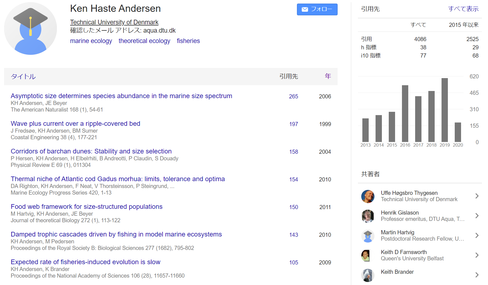

```{r setup, include=FALSE}
knitr::opts_chunk$set(echo = FALSE,
                      cache= TRUE)
options(tinytex.verbose = TRUE)
```

## 著者について {.smaller}
### Ken H. Andersen

\begin{columns}
\column{0.30\textwidth}

```{r photo, out.width=100}

```

\column{0.70\textwidth}

I want to understand how life in the ocean is organised, why marine organisms look and act the way they do, and how marine ecosystems react to perturbations like  fishing, species removals/invasions or climate change.  
  
\vspacesmall
More specifically I work on:  

- Trait-based models of life in the ocean  

- Size-structured models of marine ecosystems  

- Fisheries induced  evolution  
  
\vspacesmall
Previously I have worked with sand ripples under surface waves and barchan dunes in deserts.

\end{columns}

## Google Scholar Citation

```{r google_scholar_citation}

```


## この本のレビュー {.smaller}

\begin{columns}
\column{0.30\textwidth}

```{r about_book, out.width=100}
knitr::include_graphics("FishEcoEvoBook.jpg")
```

\column{0.70\textwidth}

- "Andersen pulls together a cohesive theory from a synthesis of decades of work. He presents a clear and pragmatic foundation for understanding the dynamics at the heart of fisheries and ecology—of individuals, populations, and communities. This leveler will help pave the way for many to tackle the leviathan that is multispecies fisheries."—Beth Fulton

\vspacesmall
- "This book is a fantastic explanation of size- and trait-based analysis of marine ecosystems that should be required reading for marine ecologists and fisheries scientists. Among other results, Andersen provides insights into a community-based approach to ecosystem-based fisheries management."—Ray Hilborn

\end{columns}

---

\begin{LARGE} 
\begin{center}
\begin{bf}
Chapter 1  
  
Nothing as Practical as a Good Theory
\end{bf}
\end{center}
\end{LARGE}

  
## １章の内容


## 魚の漁業管理の現状

<!-- \bdoublespace -->

- 魚は約1gから100kgまでの体サイズをもち、海の優占的な生物  
\vspacelarge
- 生産性は高く、人々の食糧と富の供給源  
\vspacelarge
- 水産業は世界のたんぱく質の消費量の10％を供給し、その価値は100億ドル (FAO 2016)  
\vspacelarge
- 20世紀半ばに近代トロールの技術が登場して以来、魚類資源の過剰利用が可能になった  
\vspacelarge
- 高い漁獲量を維持するためには、漁業管理が必要である  

<!-- \edoublespace -->

## Beverton and Holt
  
  
漁業管理勧告の多くはべバートン・ホルトの枠組みに基づいており、老朽化している

```{r BH, out.width=250,fig.align='center'}

```


## 漁業管理が直面している課題と疑問

- 単一資源管理から生態系アプローチへの拡張  
\vspacelarge
- 漁業による選択の長期的な進化的影響は？  
\vspacelarge
- 生物宅的情報が（ほとんど）ない状況、特に開発途上国において、多くの割合を占める「データ不足 (data poor)」な資源をどう管理すべきか？  
\vspacelarge
- 種の多様性が高く、種をほとんど区別しない漁業が実施されており、資源毎の管理が非現実的な多くの生態系をどう扱うべきか？


## 水産資源学と一般生態学

- 手助けやインスピレーションの基となるのは（一般）生態学である  
\vspacelarge
- べバートンとホルトがその枠組みを構築して以来、水産資源学は生態学からは分岐し、管理のための実践的な場面への適用に重きを置くようになった  
\vspacelarge
- 水産資源学は独自の会議や学会を発展させ、プロシーディングスや会議文書といったグレイペーパーや専門的な雑誌で研究発表を行ってきた  
\vspacelarge
- 一方で生態学は、陸水学・食物網生態学・構造のある個体群・進化生態学といった水産資源学にも関連する分野を発展させた 

## 関連分野における生態学の発展 {.smaller}

### 陸水学  
- 多様性が低く、生息地の構造が単純であるため、観察や理解が容易
- 構造をもつ個体群の消費者―資源動態の発展
- 漁業が行われていない海の状態に近い

### 食物網生態学  
- 食物網構造と安定性の関係に着目し、普遍的なパターンを探求
- 漁業などの攪乱への応答は中心的な課題ではなかった  

### 進化生態学
- "Life history invariants"は魚類の観察から生まれた
- 子のサイズ戦略の多様性、繁殖戦略、不定成長の進化は魚類進化の中心的問い
- 魚類の生活史の理解が水産資源学にはあまり応用されていない


## この本の目的
  
- サイズベース・形質ベースのアプローチを、
魚類の個体群と群集をモデリングするための近代的で一貫した統一的枠組みとして紹介する  
\vspacesmall
- 本理論は生態学と水産資源学の新しい発展から編み出されており、漁業と生態学の問題に幅広く適用可能である  
\vspacesmall
- 長期間放置されてきた、魚類生態学と水産資源学の思考の統一に貢献したい  
\vspacesmall
- ここでは本理論の基本要素を説明するが、古典的な水産資源学に由来する要素から始めて、次に海洋生態学・生理学的に構造化した個体群モデル・形質生態学において発展したサイズベース理論を紹介する


## 著者の方針  {.smaller}

- 生態系アプローチを漁業管理に適用できるように、べバートン・ホルトの枠組みを修復し、欠けている要素を補うという誘惑に駆られるかもしれない  
<!-- \vspacesmall -->
<!-- - 2つのバイクを溶接して、エンジンを追加して自動車を作るようなものだ   -->
<!-- \vspacesmall -->
- べバートン・ホルトの修復では、
<!-- 私が追い求める -->厳密な理論は構築できない(2つのバイクを溶接して自動車を作るようなものだ！)  
<!-- \vspacesmall -->
- 漁業の勧告のような実践的な応用は、確固とした理論的・基礎的理解に基づくのがベストであるはず
（この本のタイトルにある名言を作ったKurt Lewinと同様に）  
<!-- \vspacesmall -->
- von Bertalanffyの成長式・スプレッドシートに適した生命表・親魚の死亡率$M$の概念を捨て,その代わりに生理学・微分方程式・サイズ依存の死亡率を使用する  
<!-- \vspacesmall -->
- 本理論は、Hilborn & Walters (1992) やQuinn & Deriso (1999)といった古典に精通している人には取っつきにくく、複雑に感じるかもしれない  
<!-- \vspacesmall -->
- 少ない仮定のみで、単一種の影響評価から進化率の推定や生態系の影響評価まで行えることが本理論の利点である

## 


